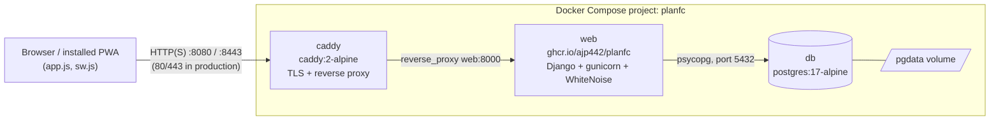

# planFC — Architecture

This document explains how the source code is put together and why. It covers the
code as it stands after the **Foundation proof of concept**. For scope, milestones
and product decisions, see [`PLAN.md`](../PLAN.md). For how to run things, see
[`README.md`](../README.md).

Update this file when the shape of the system changes, for example when a new
Django app, a new service or a new deployment path is added. Small changes inside
an existing file don't need an update.

---

## Contents

- [1. The system at a glance](#1-the-system-at-a-glance)
- [2. Repository layout](#2-repository-layout)
- [3. The Django application](#3-the-django-application)
  - [3.1 Settings (`config/settings.py`)](#31-settings-configsettingspy)
  - [3.2 URL routing (`config/urls.py`)](#32-url-routing-configurlspy)
  - [3.3 Views (`core/views.py`)](#33-views-coreviewspy)
  - [3.4 Models and migrations](#34-models-and-migrations)
  - [3.5 Tests (`core/tests.py`)](#35-tests-coretestspy)
- [4. The client side (PWA)](#4-the-client-side-pwa)
  - [4.1 The page (`core/templates/core/index.html`)](#41-the-page-coretemplatescoreindexhtml)
  - [4.2 The manifest (`core/templates/pwa/manifest.webmanifest`)](#42-the-manifest-coretemplatespwamanifestwebmanifest)
  - [4.3 The service worker (`core/templates/pwa/sw.js`)](#43-the-service-worker-coretemplatespwaswjs)
  - [4.4 The page script (`static/js/app.js`)](#44-the-page-script-staticjsappjs)
  - [4.5 Styling and icons](#45-styling-and-icons)
- [5. Containers and deployment](#5-containers-and-deployment)
  - [5.1 The image (`Dockerfile`)](#51-the-image-dockerfile)
  - [5.2 Compose: one file for deployers, an overlay for developers](#52-compose-one-file-for-deployers-an-overlay-for-developers)
  - [5.3 Caddy and TLS](#53-caddy-and-tls)
  - [5.4 Configuration surface (`.env`)](#54-configuration-surface-env)
  - [5.5 Release pipeline (`.github/workflows/publish.yml`)](#55-release-pipeline-githubworkflowspublishyml)
- [6. Request lifecycle, end to end](#6-request-lifecycle-end-to-end)
- [7. Known gaps and things to watch](#7-known-gaps-and-things-to-watch)

---

## 1. The system at a glance

planFC is a server-rendered Django application backed by PostgreSQL. It runs behind
a Caddy reverse proxy, and all three run as containers under Docker Compose. The
browser side is a Progressive Web App (PWA): ordinary HTML pages plus a web app
manifest and a service worker, so members can install it to their home screen
without going through an app store.



| Layer | Technology | Where it's defined |
|---|---|---|
| Edge / TLS | Caddy 2 | `compose.yaml` (`caddy` service and the inline `caddyfile` config) |
| Application | Django 5.2, gunicorn (prod) or `runserver` (dev) | `config/`, `core/`, `Dockerfile` |
| Static files | WhiteNoise, baked into the image | `config/settings.py`, `Dockerfile` |
| Database | PostgreSQL 17 | `compose.yaml` (`db` service) |
| Client | Plain HTML/CSS/JS, service worker, manifest | `core/templates/`, `static/` |
| Delivery | GitHub Actions → GHCR, multi-arch | `.github/workflows/publish.yml` |

There is no JavaScript build step, no frontend framework and no task queue yet.
Every piece listed above is something the Foundation milestone needs. Nothing is
there speculatively.

---

## 2. Repository layout

```
.
├── config/                 Django project package (settings, root URLs, WSGI)
│   ├── settings.py
│   ├── urls.py
│   └── wsgi.py
├── core/                   The single Django app so far
│   ├── views.py            index page and /healthz
│   ├── tests.py
│   ├── apps.py
│   ├── migrations/         empty: no models yet
│   └── templates/
│       ├── core/index.html         the page
│       └── pwa/
│           ├── manifest.webmanifest   rendered as a Django template
│           └── sw.js                  rendered as a Django template
├── static/                 Authored static assets (source for collectstatic)
│   ├── css/app.css
│   ├── js/app.js           SW registration, install button, status display
│   └── icons/*.png         placeholder icons
├── tools/make_icons.py     Generates the placeholder icons (Pillow)
├── manage.py
├── requirements.txt
├── Dockerfile              The `web` image
├── compose.yaml            Production-shaped deployment, standalone
├── compose.override.yaml   Dev overlay, auto-merged in a clone
├── .env.example            Template for the only file a deployer edits
└── .github/workflows/publish.yml
```

Django convention splits the *project* (`config/`, which holds settings and wiring)
from *apps* (`core/`, which holds features). Future milestones should add new apps
next to `core` rather than growing `core`. The likely ones are `accounts`, `games`
and `ledger`, which map onto the PLAN.md milestones.

---

## 3. The Django application

### 3.1 Settings (`config/settings.py`)

All configuration comes from **environment variables**. No settings are split per
environment, and there is no `local_settings.py`. The same image runs in dev and
prod, and Compose supplies different environments.

| Variable | Behaviour |
|---|---|
| `DJANGO_SECRET_KEY` | **Required, no default.** Read with `os.environ[...]`, so a missing key crashes at import. This is on purpose: a payment ledger shouldn't quietly boot on a well-known signing key. |
| `DJANGO_DEBUG` | `"1"` turns debug on. Anything else, including unset, means off. Secure by default. |
| `DJANGO_ALLOWED_HOSTS`, `DJANGO_CSRF_TRUSTED_ORIGINS` | Comma-separated, parsed by the small `env_list()` helper. The example `.env` allows `.trycloudflare.com` so quick tunnels work for phone testing. |
| `POSTGRES_*` | Database connection. `POSTGRES_HOST` defaults to `db`, the Compose service name. |

Other choices in this file:

- **WhiteNoise** sits directly after `SecurityMiddleware` and serves `/static/`
  from inside the Django process. `CompressedManifestStaticFilesStorage` writes
  content-hashed, pre-compressed copies at `collectstatic` time, so every asset
  URL changes when its content changes and can be cached forever. Caddy therefore
  doesn't need to share a volume with `web`. It proxies everything.
- **`SECURE_PROXY_SSL_HEADER`** trusts `X-Forwarded-Proto` from Caddy. Django only
  ever sees plain HTTP on port 8000, so without this setting it would think every
  request was insecure. That would break `request.is_secure()`, secure cookies and
  CSRF origin checks once the site runs on HTTPS.
- **`TIME_ZONE = "America/Chicago"`** with `USE_TZ = True`. Datetimes are stored in
  UTC and shown in local time. Game times will depend on this.
- **`DEFAULT_AUTO_FIELD = BigAutoField`**, the modern default.
- The admin, auth, sessions and messages contrib apps are installed. That gives a
  working `/admin/` and the tables `django-allauth` will build on in the Login
  milestone.

### 3.2 URL routing (`config/urls.py`)

| Path | Handler | Notes |
|---|---|---|
| `/` | `core.views.index` | The only human-facing page |
| `/healthz` | `core.views.healthz` | JSON liveness plus a DB round-trip |
| `/sw.js` | `TemplateView` → `pwa/sw.js` | `application/javascript` |
| `/manifest.webmanifest` | `TemplateView` → `pwa/manifest.webmanifest` | `application/manifest+json` |
| `/admin/` | Django admin | No superuser exists until you create one |
| `/static/...` | WhiteNoise middleware | Not in `urls.py` at all |

The important decision here is that **`sw.js` is served from the site root through
Django, not from `/static/`**. A service worker can only control URLs at or below
the path it was served from. At `/static/sw.js` it could only control `/static/*`,
and the app would never be installable. Serving it as a template has a second
benefit: `` resolves the content-hashed asset URLs, so the worker always
caches the exact files the current release serves. The manifest is templated for
the same reason, because its icon URLs are hashed.

### 3.3 Views (`core/views.py`)

Two function views share one helper:

- `_database_reachable()` runs `SELECT 1` and returns `True`/`False`. It catches
  every exception, because the whole point is to *report* a broken database rather
  than fail with a 500.
- `index` renders `core/index.html` with `db_ok`, which the page shows as a
  green or red dot.
- `healthz` returns `{"status": "ok", "database": true}` with 200, or
  `"degraded"` with **503**. The status code matters because it is the part a
  container or uptime healthcheck can act on. Nothing calls it yet; it was built
  so a Compose `healthcheck:` on `web` can be added later.

### 3.4 Models and migrations

There are none yet. `core/migrations/` holds only `__init__.py`. The `migrate` run
at startup creates Django's built-in tables (auth, admin, sessions, contenttypes).

When the ledger arrives, keep to the constraint PLAN.md sets: money is
`DecimalField`, never float, and records carry non-editable creation timestamps.

### 3.5 Tests (`core/tests.py`)

The tests use Django's `TestCase` against the **real Postgres** in the Compose
stack (`docker compose run --rm web python manage.py test`), not SQLite. The test
runner creates and destroys a `test_planfc` database. This follows PLAN.md's point
that the risky logic (money, signup races) needs a real database.

Current coverage is structural, not behavioural:

- `PageTests`: the index renders; `/healthz` reports the database as up.
- `ProgressiveWebAppTests`: `/sw.js` is served from the root with the right
  content type; the manifest is valid JSON with `start_url`, `display: standalone`
  and the 192 and 512 icon sizes Chrome requires; the index links both the manifest
  and `apple-touch-icon`.

These tests pin down the PWA installability requirements. They are easy to break
without noticing, and a break only shows up on a phone.

---

## 4. The client side (PWA)

The client is deliberately framework-free. It consists of three authored files and
two templated ones.

### 4.1 The page (`core/templates/core/index.html`)

A single status card. It shows three checks: the database (rendered by the server
from `db_ok`), service worker registration and display mode (both filled in by
`app.js`). It also has an install button and an iOS instruction hint, both hidden
until `app.js` shows them. The `<head>` carries two sets of PWA metadata:

- the standard `<link rel="manifest">` and `theme-color`, and
- Apple-specific tags (`apple-touch-icon`, `apple-mobile-web-app-*`). iOS ignores
  the manifest's icons when you add the site to the home screen. Without these
  tags the icon would be a screenshot of the page.

### 4.2 The manifest (`core/templates/pwa/manifest.webmanifest`)

`display: standalone`, `start_url` and `scope` of `/`, pitch-green theme colour,
and three icons: 192 and 512 with `purpose: any`, plus a 512 maskable icon. The
maskable icon has a full-bleed background with the mark inside the 80% safe zone,
so Android can crop it to any launcher shape.

### 4.3 The service worker (`core/templates/pwa/sw.js`)

It follows the standard *app shell* lifecycle:

1. **install**: pre-cache `SHELL` (CSS, JS, one icon) into a cache named
   `CACHE_VERSION`, then `skipWaiting()` so the new worker takes over immediately.
2. **activate**: delete every cache whose name isn't `CACHE_VERSION`, then
   `clients.claim()` so open tabs are controlled without a reload.
3. **fetch**, which uses one of three strategies:
   - **Non-GET**: not intercepted. The comment says it plainly: a ledger must never
     serve a POST from cache.
   - **Navigations (pages)**: *network-first*. Fetch fresh and store a copy. If
     offline, fall back to the cached copy of that page, then to the cached `/`.
     Members should never see a stale game list while they're online.
   - **Everything else**: *cache-first*. Serve the cached copy if there is one,
     otherwise go to the network. This is safe because static URLs are
     content-hashed.

**Releasing a change.** A browser installs a new worker whenever the bytes of
`sw.js` change. Because `SHELL` holds hashed URLs, any change to a shell asset
already changes `sw.js`. Bumping `CACHE_VERSION` on top of that is what makes
`activate` delete the *old* cache instead of adding to it. So the rule in the file
still stands: bump it whenever the shell changes.

### 4.4 The page script (`static/js/app.js`)

A single IIFE with four jobs:

1. **Register** `/sw.js` and report the result and scope.
2. **Detect display mode.** It checks each `display-mode` media query by name,
   because Chrome may pick `minimal-ui` or `window-controls-overlay` instead of
   `standalone`. It also checks iOS's `navigator.standalone`. It re-checks on
   `change`, because the window can still be settling on first launch after install.
3. **Custom install button** (Chrome/Android). It captures `beforeinstallprompt`,
   holds the single-use event, and shows the button. The button calls `prompt()`
   once and hides itself.
4. **iOS hint.** iOS has no install API, so on an iPhone or iPad not already
   installed, the script shows "Share → Add to Home Screen".

### 4.5 Styling and icons

`static/css/app.css` defines colour tokens on `:root` and redefines them under
`prefers-color-scheme: dark`. It pads the body with `env(safe-area-inset-*)`, which
keeps content clear of the notch and home indicator when the app runs installed.
The icons are placeholders generated by `tools/make_icons.py`, a Pillow script
that isn't part of the runtime. It isn't in `requirements.txt`, and it can be
deleted once there's a real crest.

---

## 5. Containers and deployment

### 5.1 The image (`Dockerfile`)

A single stage built on `python:3.12-slim`. The layers are ordered for caching:
`requirements.txt` and `pip install` come first, then the source, so editing code
doesn't rebuild dependencies. Other details:

- It runs as a non-root `app` user. `APP_UID` is a build arg so that in dev, files
  written into the bind-mounted source tree stay owned by the host user.
- `collectstatic` runs **at build time** with a throwaway secret key, because
  settings refuse to load without one. Static files are therefore part of the
  immutable image.
- `CMD` runs `migrate`, then `exec gunicorn config.wsgi:application` with 3
  workers. The migration lives in `CMD` rather than an `ENTRYPOINT`, so one-off
  commands like `docker compose run web python manage.py test` skip it.

### 5.2 Compose: one file for deployers, an overlay for developers

This is the most important design decision on the operations side.

**`compose.yaml` is complete on its own.** A deployer downloads just this file and
`.env`, runs `docker compose up -d`, and gets the published image from GHCR. To
make that possible:

- The Caddyfile is **inlined** as a Compose `configs:` entry (this needs Compose
  2.23+), so there's no second file to fetch. `$$` stops Compose from expanding
  `{$SITE_ADDRESS}`, which Caddy then reads from its own environment.
- Required secrets use `${VAR:?message}`, so Compose refuses to start with a clear
  error instead of starting a broken stack.
- `web` waits for `db` to be **`service_healthy`** (checked with `pg_isready`).
  Without that, `migrate` races Postgres's first-boot initialisation and exits.
- `restart: unless-stopped` everywhere. `pgdata`, `caddy_data` (certificates) and
  `caddy_config` are named volumes.

**`compose.override.yaml` is merged automatically** when both files sit in the same
directory, which happens only in a clone. It changes `web` to:

- build from source under a local tag `planfc-web:dev` (`pull_policy: build`), so a
  dev build never shadows the real GHCR image;
- bind-mount `.:/app` and run `migrate`, `collectstatic`, then `runserver` for
  live reload;
- set `DJANGO_DEBUG=1`.

The two modes behave like this:

| | Deployer (`compose.yaml` only) | Developer (clone) |
|---|---|---|
| Image | `ghcr.io/ajp442/planfc:${PLANFC_VERSION:-latest}` | built locally as `planfc-web:dev` |
| Server | gunicorn, 3 workers | `runserver` with reload |
| Debug | off | on |
| Source | baked into the image | bind-mounted |

### 5.3 Caddy and TLS

The whole Caddyfile is:

```
{$SITE_ADDRESS} {
	encode gzip
	reverse_proxy web:8000
}
```

`SITE_ADDRESS` defaults to `:80`, which means plain HTTP on any hostname. That is
enough for `localhost`, because browsers treat localhost as a secure context for
service workers. Setting it to a domain such as `planfc.com`, with host ports
80/443, makes Caddy obtain and renew a Let's Encrypt certificate by itself. HTTPS is
a hard requirement for installing the PWA on a phone. Until the domain exists, a
Cloudflare quick tunnel provides it, which is why `.trycloudflare.com` appears in
the example allowed hosts.

### 5.4 Configuration surface (`.env`)

`.env` is the only file a deployer edits. `.env.example` documents every variable
and its default. Only `DJANGO_SECRET_KEY` and `POSTGRES_PASSWORD` are required.
The `.gitignore` excludes `.env` and `.env.*` but not `.env.example`, and
`.dockerignore` keeps `.env` out of the image.

### 5.5 Release pipeline (`.github/workflows/publish.yml`)

- **Trigger:** pushing a tag `v*.*.*` only. Pushes to `main` publish nothing, so
  `latest` moves only on a deliberate release.
- Buildx plus QEMU build **linux/amd64 and linux/arm64** (Raspberry Pi, ARM VPS).
- `docker/metadata-action` tags `v1.2.3` as `1.2.3`, `1.2` and `latest`. The image
  name is lowercase because GHCR requires it.
- It authenticates with the built-in `GITHUB_TOKEN` (`packages: write`), and uses
  the GitHub Actions layer cache.

The pipeline doesn't run tests yet. See [§7](#7-known-gaps-and-things-to-watch).

---

## 6. Request lifecycle, end to end

This is what happens when someone opens the app for the first time:

1. The browser requests `/`. Caddy receives it (on :8080 in dev, :443 in
   production) and forwards it to `web:8000` with `X-Forwarded-Proto` set.
2. Middleware: Security → WhiteNoise (not a static path, so it passes through) →
   sessions → CSRF → auth → messages.
3. `core.views.index` runs `SELECT 1` against `db` and renders `index.html` with
   hashed `/static/...` URLs.
4. The browser fetches the CSS, JS and icons. WhiteNoise answers them from inside
   Django with long-lived cache headers.
5. `app.js` registers `/sw.js`. Django renders it from its template. The worker
   installs, pre-caches the shell and claims the page.
6. The browser fetches `/manifest.webmanifest`. With the manifest, the icons, a
   service worker and a secure context all in place, Chrome fires
   `beforeinstallprompt` and the **Install planFC** button appears. On iOS the
   Share-sheet hint appears instead.
7. On later visits, the service worker handles static assets from cache and fetches
   pages from the network first, falling back to the cache when offline.

---

## 7. Known gaps and things to watch

These come from reading the code against PLAN.md. None of them is a bug in what
the Foundation is meant to prove.

- **No CI test run.** The workflow publishes images but never runs
  `manage.py test`. PLAN.md's Foundation exit criterion ("deploys through CI")
  implies a test job that gates publishing.
- **No backups.** `pgdata` is a volume, not a backup. PLAN.md requires a scheduled
  `pg_dump` off-host, plus a restore that has actually been tested, before any real
  payment data exists.
- **`/healthz` is unused.** Adding it as a `healthcheck:` on `web` in
  `compose.yaml` would let Compose, and later monitoring, see a degraded app.
- **The service worker caches every page it navigates to.** That's harmless for a
  public status page. Once logins exist, it would store per-member pages, including
  balances, in the browser cache, and could show them offline to whoever uses the
  device next. Before the Login milestone ships, either exclude authenticated pages
  from the navigation cache or clear the caches on logout.
- **The offline fallback to `/` only works after `/` has been visited online,**
  because `/` isn't in the pre-cached `SHELL`.
- **Security headers for HTTPS** (`SESSION_COOKIE_SECURE`, `CSRF_COOKIE_SECURE`,
  HSTS) aren't set yet. They should turn on once the site runs on a real domain.
- **Single app.** `core` is a placeholder. Put real features in their own apps
  ([§2](#2-repository-layout)) so the ledger's models and tests stay separate.
